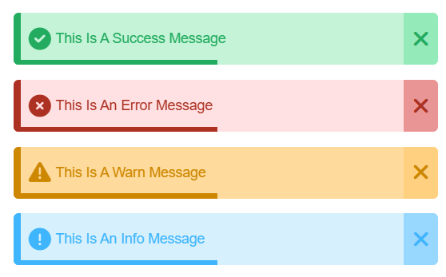

## Simple Custom Toasts

#### You can use very simple and at the same time professional notifications.

### Installation

1. **Download the files**

   - Download the simple-custom-toasts folder containing the necessary files (HTML, CSS, JS, PHP, helper function).

2. **Add the files to your project**

   - Include the `i-toasts.blade.php` in the file (e.g., `master.blade.php`).

   ```php
   @include('path.to.i-toasts')
   ```

   - Place the `i-toasts.css` in the appropriate directories in your project (e.g., `public/css` for CSS).
   - Place the `i-toasts.php` in your helpers folder or wherever your helper functions are stored.

   ```php
   require_once 'path/to/i-toasts.php';
   ```

3. **Include the CSS file**
   In your main layout file (e.g., `layout.blade.php`), include the CSS file:
   ```html
   <link rel="stylesheet" href="{{ asset('css/i-toasts.css') }}" />
   ```

### Usage

```php
addIToast('success', 'This is a success message');
addIToast('error', 'This is an error message');
addIToast('warn', 'This is a warn message');
addIToast('info', 'This is an info message');
```

#### or

```php
# put or flash
session()->put('success', 'This is a success message');
session()->put('error', 'This is an error message');
session()->flash('warn', 'This is a warn message');
session()->flash('info', 'This is an info message');
```

#### or

```php
return redirect()->with('success', 'This is a success message');
return redirect()->with('error', 'This is an error message');
return redirect()->with('warn', 'This is a warn message');
return redirect()->with('info', 'This is an info message');
```

### mockup



### Contributing

Contributions are welcome! Please open an issue or submit a pull request.

### Contact me

#### If you have any questions or need further assistance, you can reach out to me:

#### Email: [eslamalsayed8133@gmail.com](mailto:eslamalsayed8133@gmail.com)

#### LinkedIn: [IslamAlsayed](https://www.linkedin.com/in/islam-alsayed7)
